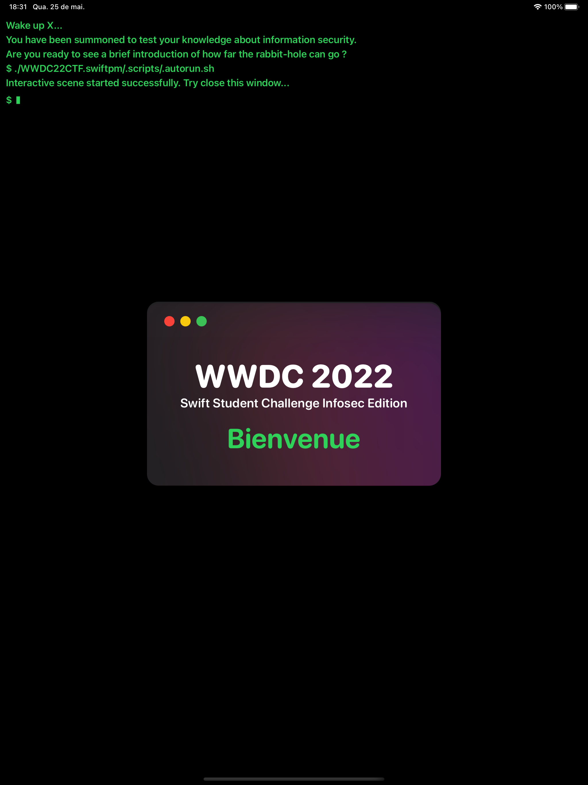

# WWDC 2022 CTF
 

  

# Summary
My **[accepted]** WWDC Swift Student Challenge 2022 submission is about information security and its main goals are to give a brief introduction to the subject and make the user aware of the importance of having good digital security practices, in a realistic and funny way. 

To achieve these goals, a minimalist and intuitive design based on the macOS and iOS operating systems composed by a mix between terminal (command line) and graphical interface guides the user through informative challenges that they will see to complete the interactive scene. 

## How to run
* Download or clone the repository
* Right click the Swift package manager file (.swiftpm)
* Select the "Open with Xcode" option
* Launch the app by pressing ⌘R

## Minimum Requisites
* Mac OS BigSur
* Xcode 13
* iPadOS 15.2

## Screenshots
* Main screen

    

* Real threats mini-game

    

* Password Strenght Meter

    

